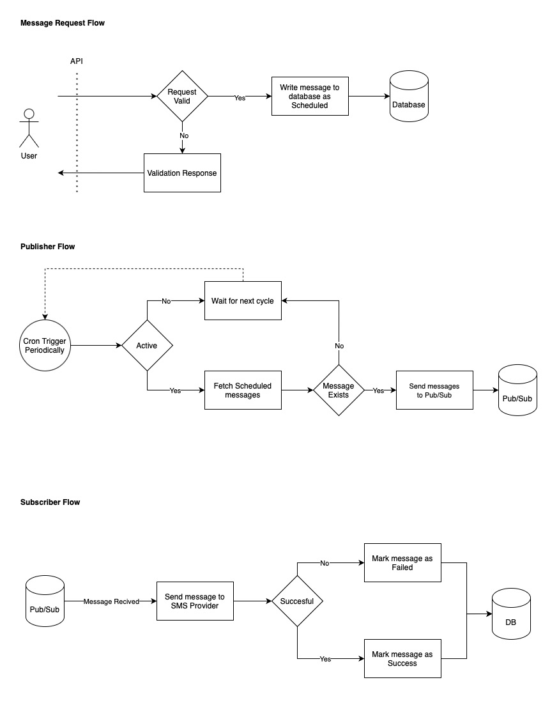

# Notification Application

Simple notification application that excepts sms messages, schedules and periodically sends them to the third-party SMS provider.

# Installation

## Prerequisites

- Docker
- Docker Compose
- Git

## Running the Application

### Using Docker Compose

1. Clone the repository:

```bash
git clone https://github.com/ensarkovankaya/go-notification-app.git
cd go-notification-app
```

2. Copy the `.example-env` file to `.env` and modify the environment variables if needed:

```bash
cp .example-env .env
```

3. Retrieve a webhook URL from webhook.site:

To simulate third-party SMS provider, the application uses webhook.site as a mock provider. You can find the documentation of
webhook.site in the `docs/webhook.yaml` file.

Before running the application, get a new webhook URL from webhook.site (e.g.,
`https://webhook.site/c6e22413-17a9-43f3-ad66-b83cb8be515e`).

In this example, set the unique ID (`c6e22413-17a9-43f3-ad66-b83cb8be515e` in this example) as the `WEBHOOK_ID` environment variable in the `.env`
file.

webhook.site response should be configured as below:
- Set response status code to `202`
- Set response content to `{"messageId": "random-message-id", "message": "Accepted"}`

4. Build the application:

Choose the appropriate build platform values for your system from the table below:

| Target System                      | BUILDPLATFORM Value | TARGETARCH Value |
|------------------------------------|---------------------|------------------|
| **Mac (Apple Silicon - M1/M2/M3)** | `linux/arm64`       | `arm64`          |
| **Intel Mac / Linux x86_64**       | `linux/amd64`       | `amd64`          |
| **Windows (WSL2 / Intel x86_64)**  | `linux/amd64`       | `amd64`          |
| **Windows (WSL2 / ARM64)**         | `linux/arm64`       | `arm64`          |

Then run the build command:

```bash
docker-compose build --build-arg BUILDPLATFORM=linux/arm64 --build-arg TARGETARCH=arm64
```

3. Start the application:

```bash
docker-compose up -d
```

The application will be available at `http://localhost:9098/api`

## Environment Variables

### Postgres

| Variable               | Default Value   | Description       |
|------------------------|-----------------|-------------------|
| POSTGRES_PASSWORD      | postgres        | Database password |
| POSTGRES_DB            | notification    | Database name     |
| POSTGRES_USER          | postgres        | Database username |
| POSTGRES_HOST          | localhost       | Database host     |
| POSTGRES_PORT          | 5432            | Database port     |
| POSTGRES_TIMEZONE      | Europe/Istanbul | Database timezone |
| POSTGRES_GORM_SSL_MODE | disable         | GORM SSL mode     |

### Application

| Variable   | Default Value | Description                                                      |
|------------|---------------|------------------------------------------------------------------|
| PORT       | 9098          | Application HTTP server running port                             |
| DB_URI     |               | Database URI                                                     |
| REDIS_URI  |               | Redis URI                                                        |
| WEBHOOK_ID |               | Unique webhook ID from webhook.site                              |
| LOG_LEVEL  | ERROR         | Set application log level (can be one of: DEBUG, INFO, ERROR, WARNING) |
| CRON_TTL   | 2m            | Cron job period                                                  |

Configuration can be done through environment variables. See the `.example-env` file for available options.

## Documentations

API documentation is available at `docs/api.yaml` file.
Webhook client documentation is available at `docs/webhook.yaml` file.

### Example Requests

#### List messages

Request:
```bash
curl --location 'http://localhost:9098/api/messages' \
--header 'Accept: application/json'
```

Response:
```json
{
    "limit": 100,
    "offset": 0,
    "total": 2,
    "data": [
        {
            "id": 3,
            "recipient": "+905551234123",
            "status": "SUCCESS",
            "content": "Lorem ipsum dolor sit amet, consectetur adipiscing elit, sed do eiusmod tempor incididunt ut labore et dolore magna aliqua.",
            "messageID": "f423deb8-9dd2-4176-8c4d-b81fda4d0e42",
            "sentTime": "2025-02-06T18:54:06.204+03:00",
            "createdAt": "2025-02-06T18:54:03.244+03:00",
            "updatedAt": "2025-02-06T18:54:06.204+03:00"
        },
        {
            "id": 2,
            "recipient": "+905551234123",
            "content": "Neque porro quisquam est qui dolorem ipsum quia dolor sit amet, consectetur, adipisci velit...",
            "status": "FAILED",
            "messageID": null,
            "sentTime": "2025-02-06T18:53:46.231+03:00",
            "createdAt": "2025-02-06T18:53:36.217+03:00",
            "updatedAt": "2025-02-06T18:53:46.231+03:00"
        },
        {
            "id": 1,
            "content": "Itaque earum rerum hic tenetur a sapiente delectus",
            "recipient": "+905551234567",
            "messageID": null,
            "sentTime": null,
            "status": "SCHEDULED",
            "createdAt": "2025-02-06T18:51:56.084+03:00",
            "updatedAt": "2025-02-06T18:52:06.268+03:00"
        }
    ]
}
```

#### Send message

Request:
```bash
curl --location 'http://localhost:9098/api/messages' \
--header 'Content-Type: application/json' \
--header 'Accept: application/json' \
--data '{
  "recipient": "+905551234567",
  "content": "Hello world"
}'
```

Response:
```json
{
    "id": 1,
    "recipient": "+905551234567",
    "content": "Hello world",
    "messageID": null,
    "sentTime": null,
    "status": "SCHEDULED",
    "createdAt": "2025-02-06T18:51:56.084+03:00",
    "updatedAt": "2025-02-06T18:51:56.084+03:00"
}
```

#### Get Cron Job Status

Request:
```bash
curl --location 'http://localhost:9098/api/cron/' \
--header 'Accept: application/json'
```

Response:
```json
{
    "active": true
}
```

#### Activate / Deactivate Cron Job

Request:
```bash
curl --location 'http://localhost:9098/api/cron/' \
--header 'Content-Type: application/json' \
--header 'Accept: application/json' \
--data '{
  "active": true
}'
```

Response:
```json
{
    "active": true
}
```

# Architecture

The application works in three parts:

- HTTP server that handles incoming requests and writes messages to the database for later processing.
- Cron job that periodically checks the database for messages ready to be sent and sends them to the message broker.
- Message broker that receives messages from the cron job and sends them to the third-party SMS provider.



## Folder Structure

- `handlers/` folder includes all the HTTP handlers for the application.
    - `handlers/app.go` includes probe endpoints for Kubernetes health checks.
    - `handlers/message.go` handles incoming requests and writes messages to the database for later processing.
    - `handlers/cron.go` activates/deactivates cron job HTTP handlers.
- `services/` folder includes all the business logic for the application.
    - `services/message.go` provides CRUD operations for notifications.
    - `services/publisher.go` provides the logic for the cron job. Fetches messages from database and sends them to pub/sub consumers.
    - `services/subscriber.go` provides the logic for the message broker. Listens to pub/sub messages and sends them to the SMS provider.
- `repositories/` folder includes all the ORM models and operations for the application.
- `clients/` folder includes all the third party clients for the application. Clients generated by `make client_webhook` command.

# Updating API Documentation

API documentation is available at `docs/api.yaml` file. Webhook service client documentation in this example is under `docs/webhook.yaml` file.

After documentation updated to reflect changes run the following command to generate models and clients:

```bash
make models
make client_webhook
```

# Running Tests

```bash
make test
```
